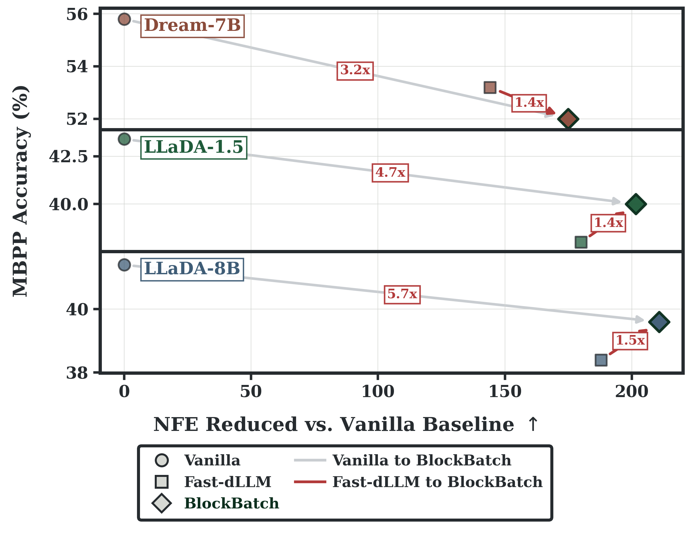
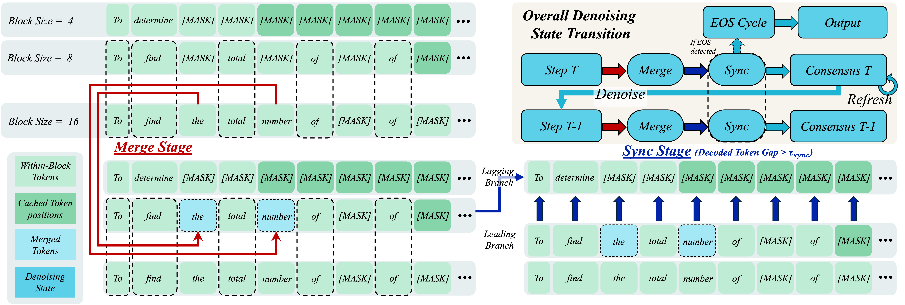
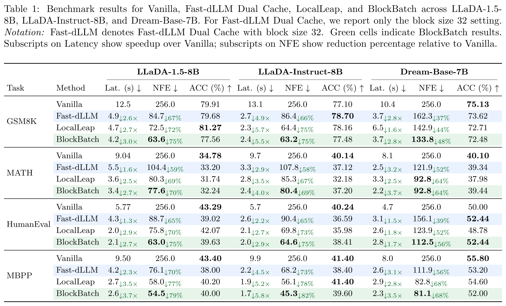

# BlockBatch

[](https://laurence-wu.github.io/BlockBatch/)
[](https://github.com/Laurence-Wu/BlockBatch)
[](#citation)
[](LICENSE)

BlockBatch is an inference acceleration framework for bidirectional
diffusion-based large language models. The paper proposes multi-scale consensus
decoding: several block-size branches are executed in batched model forwards and
coordinated with confidence-gated merging, leader-based synchronization, and
periodic full-sequence KV refresh.

## News

* [2026.05] Released the BlockBatch codebase for paper evaluation and analysis.
## TODOs

We will continue to maintain:

- [ ] Kernel accelerations
- [ ] LocalLeap evaluations
- [ ] Further implementation on more frameworks

## Demo

<div align="center">
  
  <p>BlockBatch speedup against Fast-dLLM and the vanilla baseline on MBPP.</p>
</div>

## Project Structure

```text
.
├── assets/                    # Paper figures, tables, and ablation plots
├── blockBatching_ablation/    # Main evaluation, analysis, and plotting scripts
├── dream/                     # Dream model decoding and evaluation code
├── experiements/              # Additional ablation and KV-space analysis scripts
├── llada/                     # LLaDA model decoding and evaluation code
├── ARTIFACT.md                # Artifact notes for reproducibility
├── LICENSE
├── README.md
└── requirements.txt
```

## Features

- Training-free inference acceleration for diffusion language models
- Multi-branch block-size decoding for Dream and LLaDA
- Confidence-gated branch merging and leader-based synchronization
- Periodic full-sequence KV refresh for cache correction
- Evaluation support for GSM8K, MATH, HumanEval, and MBPP

### Key Features

1. **Multi-Scale Consensus Decoding**

   BlockBatch treats block size as an online branching dimension rather than a
   fixed request-level hyperparameter. Large-block branches make aggressive
   progress, while small-block branches preserve conservative local
   conditioning. Branches are advanced together through batched forwards.

<div align="center">
  
  <p>BlockBatch multi-branch decoding pipeline.</p>
</div>

2. **Block-Size Diversity**

   The paper shows that no single block size is optimal across prompts, tasks,
   and models. BlockBatch exploits this diversity by keeping multiple
   block-size trajectories alive and exchanging high-confidence proposals only
   when branches are compatible.

<div align="center">
  
  <p>Per-sample block-size behavior motivates block size as a branching axis.</p>
</div>

3. **Paper Performance**

   Across LLaDA-1.5-8B, LLaDA-Instruct-8B, and Dream-Base-7B on GSM8K, MATH,
   HumanEval, and MBPP, BlockBatch reduces denoising NFEs by 26.6% on average
   and achieves a 1.33x average end-to-end speedup over Fast-dLLM while
   maintaining comparable task accuracy.

<div align="center">
  <a href="assets/main_table.pdf">
    
  </a>
  <p>Main benchmark results reported in the paper.</p>
</div>

## Installation

1. Clone the repository:

```bash
git clone https://github.com/Laurence-Wu/BlockBatch.git
cd BlockBatch
```

2. Install dependencies:

```bash
pip install -r requirements.txt
```

3. Configure local paths:

```bash
export PROJECT_ROOT="$(git rev-parse --show-toplevel)"
export CACHE_DIR="${HF_HOME:-${HOME}/.cache/huggingface}"
export RESULTS_DIR="${PROJECT_ROOT}/blockBatching_ablation/results"
```

For HumanEval and MBPP execution-based scoring:

```bash
export HF_ALLOW_CODE_EVAL=1
export HF_DATASETS_TRUST_REMOTE_CODE=true
```

## Usage

### 1. Baseline and BlockBatch Evaluation

```bash
python blockBatching_ablation/eval.py --model llada --task gsm8k --method baseline --analyze
python blockBatching_ablation/eval.py --model llada --task gsm8k --method block_batching --analyze
```

### 2. Fast-dLLM Dual Cache Baseline

```bash
python blockBatching_ablation/eval.py --model llada --task math --method fast_dllm --block-length 32 --analyze
```

### 3. Batch Submission Helper

```bash
python blockBatching_ablation/launch/submit.py --help
```

## Model Evaluation

| Benchmark | Models | Metrics |
| --- | --- | --- |
| GSM8K | LLaDA, Dream | latency, NFE, accuracy |
| MATH | LLaDA, Dream | latency, NFE, accuracy |
| HumanEval | LLaDA, Dream | latency, NFE, pass@1 |
| MBPP | LLaDA, Dream | latency, NFE, pass@1 |

For paper-level results, see the curated table PDF in `assets/main_table.pdf`.

## Contributing

Issues and pull requests are welcome.

## License

This project is licensed under the Apache License 2.0. See the [LICENSE](LICENSE)
file for details.

## Citation

If you find this work useful, please cite our paper:

```bibtex
@misc{wu2026blockbatch,
  title = {BlockBatch: Multi-Scale Consensus Decoding for Efficient Diffusion Language Model Inference},
  author = {Wu, Xiaoyou and Shih, Cheng-Jhih and Ji, Binfei and Liu, Yong and Lin, Yingyan (Celine)},
  year = {2026}
}
```

## Acknowledgements

We thank the authors of LLaDA, Dream, and Fast-dLLM for their open-source
diffusion language model inference code and baselines.
